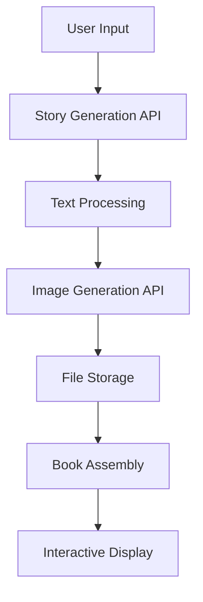

# AI Story Book Generator

## 🎥 YouTube Tutorial
My first video tutorial 📺 **Watch the full tutorial**: [From Idea to Production - Building an AI-Powered Web App](https://www.youtube.com/watch?v=I8tO0aGgvzg)

## 📖 Project Overview

This project demonstrates the complete journey from **idea conception to production deployment** of a modern AI-powered web application. Built as part of a comprehensive YouTube tutorial series, this Story Book Generator showcases how to integrate multiple AI services to create engaging, illustrated stories automatically.

## ✨ Features

### 🚀 Core Functionality
- **AI Story Generation**: Creates compelling narratives using OpenRouter's DeepSeek API
- **AI Image Generation**: Generates custom illustrations using Hugging Face's FLUX.1-schnell model
- **Intelligent Book Assembly**: Automatically splits stories into paragraphs and creates matching images
- **Interactive Book Display**: Beautiful, responsive book-style layout with page-by-page presentation

### 🎯 User Experience
- **Single Input Interface**: Generate complete illustrated stories from a simple text prompt
- **Real-time Progress Tracking**: Visual feedback throughout the generation process
- **Responsive Design**: Optimized for desktop and mobile devices
- **Copy & Share**: Easy content extraction for further use

## 🛠️ Technology Stack

### Frontend
- **Next.js 14** - React framework with App Router
- **TypeScript** - Type-safe development
- **Tailwind CSS** - Utility-first styling
- **React Hooks** - State management and effects

### Backend & APIs
- **Next.js API Routes** - Serverless backend functions
- **OpenRouter API** - AI text generation (DeepSeek Chat v3)
- **Hugging Face API** - AI image generation (FLUX.1-schnell)
- **Node.js File System** - Image storage and management

### Development & Deployment
- **npm** - Package management
- **ESLint** - Code linting
- **Git** - Version control
- **Environment Variables** - Secure API key management

## 🏗️ Architecture



### API Endpoints
- `/api/generate_story` - Story generation using OpenRouter
- `/api/text2img` - Image generation using Hugging Face

## 🚀 Quick Start

### Prerequisites
- Node.js 18+ 
- npm or yarn
- OpenRouter API key
- Hugging Face API token

### Installation

1. **Clone the repository**
   ```bash
   git clone https://github.com/yourusername/ai-story-book-generator.git
   cd ai-story-book-generator
   ```

2. **Install dependencies**
   ```bash
   npm install
   ```

3. **Environment Setup**
   Create a `.env.local` file:
   ```env
   # OpenRouter API Key
   OPENROUTER_API_KEY=your_openrouter_api_key_here
   
   # Hugging Face API Token
   HF_TOKEN=your_huggingface_token_here
   
   # Optional: Site URL for OpenRouter rankings
   NEXT_PUBLIC_SITE_URL=http://localhost:3000
   ```

4. **Get API Keys**
   - **OpenRouter**: Visit [openrouter.ai/keys](https://openrouter.ai/keys)
   - **Hugging Face**: Visit [huggingface.co/settings/tokens](https://huggingface.co/settings/tokens)

5. **Run the development server**
   ```bash
   npm run dev
   ```

6. **Open your browser**
   Navigate to [http://localhost:3000](http://localhost:3000)

## 📚 How It Works

### 1. Story Generation
- User provides a creative prompt
- OpenRouter's DeepSeek API generates a cohesive ~200-word story
- Story is automatically split into meaningful paragraphs

### 2. Image Creation
- Each paragraph is analyzed for visual content
- Custom prompts are created combining the original idea with paragraph context
- Hugging Face's FLUX.1-schnell model generates unique illustrations
- Images are saved to `public/generated_images/`

### 3. Book Assembly
- Text and images are combined into page layouts
- Responsive design adapts to different screen sizes
- Interactive features allow copying and sharing

## 📁 Project Structure

```
├── app/
│   ├── api/
│   │   ├── generate_story/
│   │   │   └── route.tsx      # Story generation endpoint
│   │   └── text2img/
│   │       └── route.tsx      # Image generation endpoint
│   ├── globals.css            # Global styles
│   ├── layout.tsx             # Root layout
│   └── page.tsx               # Main application page
├── public/
│   └── generated_images/      # AI-generated images storage
├── .env.local                 # Environment variables
├── package.json               # Dependencies and scripts
└── README.md                  # This file
```

## 🔧 Configuration

### API Models
- **Story Generation**: `deepseek/deepseek-chat-v3-0324:free`
- **Image Generation**: `black-forest-labs/FLUX.1-schnell`

### Customization Options
- Story length (short/medium/long)
- Image generation parameters
- Book layout styling
- Response format and error handling

## 🚀 Deployment

This application can be deployed on various platforms:

### Vercel (Recommended)
1. Connect your GitHub repository to Vercel
2. Add environment variables in Vercel dashboard
3. Deploy automatically on push

### Other Platforms
- **Netlify**: With serverless functions
- **Railway**: Full-stack deployment
- **AWS/Azure/GCP**: Container or serverless deployment

## 📈 From Idea to Production

This project demonstrates the complete development lifecycle:

1. **Ideation**: Identifying user needs for creative content generation
2. **Planning**: Architecting the application flow and user experience
3. **Development**: Building with modern frameworks and AI integration
4. **Testing**: Ensuring reliability and error handling
5. **Deployment**: Making the application publicly accessible
6. **Monitoring**: (Future) Analytics and performance tracking
7. **Monetization**: (Future) Subscription models and usage limits

## 🤝 Contributing

Contributions are welcome! Please feel free to submit a Pull Request.

## 📄 License

This project is licensed under the MIT License - see the [LICENSE](LICENSE) file for details.

## 🙏 Acknowledgments

- [OpenRouter](https://openrouter.ai/) for providing access to advanced AI models
- [Hugging Face](https://huggingface.co/) for state-of-the-art image generation
- [Next.js](https://nextjs.org/) for the excellent development framework
- [Tailwind CSS](https://tailwindcss.com/) for utility-first styling

## 📞 Support

If you found this tutorial helpful, please:
- ⭐ Star this repository
- 👍 Like the YouTube video
- 📤 Share with others learning web development
- 💬 Leave feedback and suggestions

---

**Built with ❤️ for the developer community**